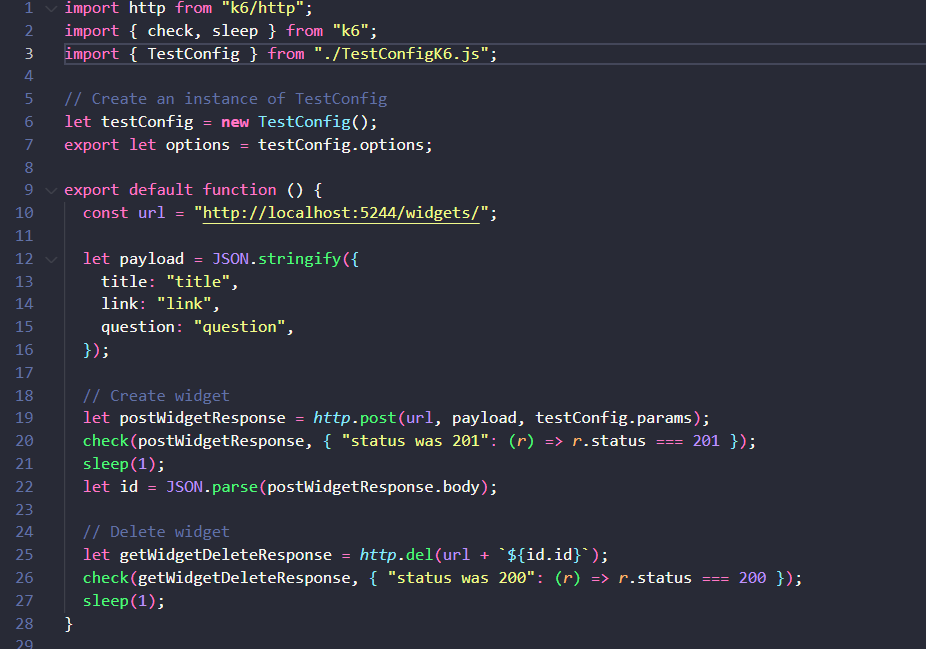
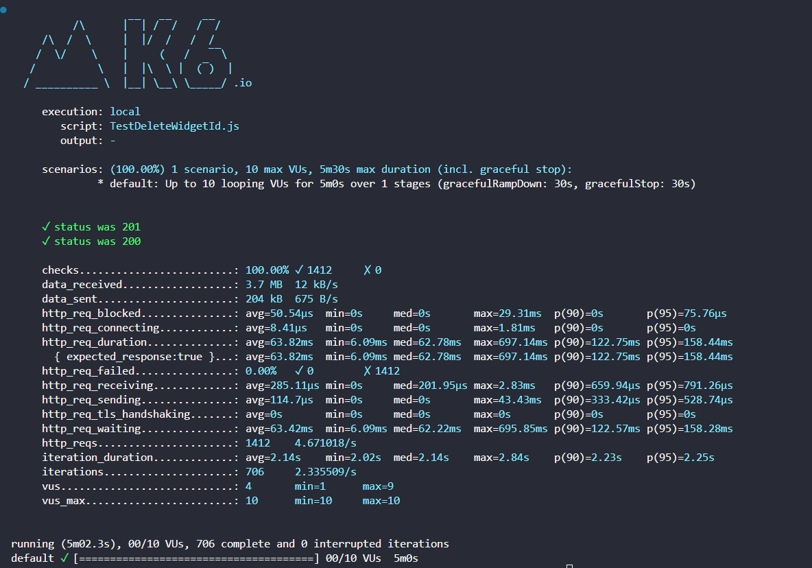

# Teste K6

## Rota escolhida
Para execução dessa atividade, o endpoint será o DELETE /widgets

## Código 

O código pode ser encontrado no repositório do grupo ou através do link desse commit : https://github.com/Inteli-College/2024-T0003-ES09-G04/commit/71d7597fccc01dc7116648b155556f2a9415bd4c

Para criar o teste da rota de DELETE, teríamos alguns problemas, pois, para utilizar a rota de DELETE, precisamos enviar o id do widget na url, isso limitaria o uso desse teste, pois informando os ids, precisaríamos criar eles no banco de dados, e passar no código um array de ids fixos, porém assim que o teste fosse executado, ele não poderia ser executado novamente, pois os ids já teriam sido deletados, para resolver esse problema, eu decidi no mesmo arquivo de testes de DELETE, antes de deletar, criar um widget, e guardar o resultado do id desse widget que é criado e passar como variável para a rota de DELETE, assim quando ele executa o teste ele cria um widget e deleta esse mesmo widget logo após, então o arquivo pode ser executado sem se preocupar em preencher o banco de dados préviamente e adicionar os ids de forma manual, conforme pode ser observado no código abaixo.

## k6
É uma ferramenta para testes de carga e desempenho, principalmente para analisar comportamentos de APIs, sua utilização é simples e fácil de ser implementada nos projetos, possui uma estrutura de : 

Script dos testes - definir quais rotas e o que será testado efetivamente

Cenários - definir quais são os cenários de testes que queremos analisar, seja de tempo de duração a quantidade de usuários.

Execução - Realiza o que está determinado nos scripts, com os cenários estabelecidos.

Resultados - Durante a execução do teste, são coletadas diversas informações sobre o desempenho da rota perante os cenários estabelecidos, essas informações são disponibilizadas ao final do teste com uma visão geral dos resultados para análise.

## Resultado

